# Herbal Plants

## Neem
**Scientific Name:** Azadirachta indica

**Details:** Neem is a fast-growing tree that can reach a height of 15–20 metres (49–66 ft), rarely to 35–40 metres (115–130 ft). It is evergreen, but in severe drought it may shed most or nearly all of its leaves. The branches are wide and spreading. It is believed to be good for one's health. Neem gum is a rich source of protein. In Myanmar, young neem leaves and flower buds are boiled with tamarind fruit to soften its bitterness and eaten as a vegetable. Pickled neem leaves are also eaten with tomato and fish paste sauce in Myanmar.

**Uses:** 
- It is considered a major component in Ayurvedic and Unani medicine and is particularly prescribed for skin diseases.
- Neem oil is also used for healthy hair, to improve liver function, detoxify the blood, and balance blood sugar levels.
- Neem leaves have been also been used to treat skin diseases like eczema, psoriasis, etc.

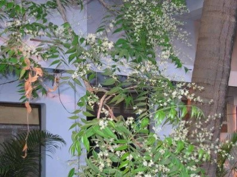

## Aloe Vera
**Details:** Aloe vera is a stemless or very short-stemmed succulent plant growing to 60–100 cm (24–39 in) tall, spreading by offsets. The leaves are thick and fleshy, green to grey-green, with some varieties showing white flecks on their upper and lower stem surfaces. The margin of the leaf is serrated and has small white teeth.

**Uses:** 
- There is some preliminary evidence to suggest that oral administration of aloe vera might be effective in reducing blood glucose in diabetic patients and in lowering blood lipid levels in hyperlipidaemia.
- Aloe vera, called kathalai in Ayurvedic medicine, is used as a multipurpose skin treatment.

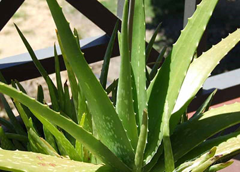

## Bitter Gourd
**Scientific Name:** Momordica charantia

**Details:** Bitter melon comes in a variety of shapes and sizes. The cultivar common to China is 20–30 cm long, oblong with bluntly tapering ends and pale green in color, with a gently undulating, warty surface. The bitter melon more typical of India has a narrower shape with pointed ends, and a surface covered with jagged, triangular "teeth" and ridges. It is green to white in color. Between these two extremes are any number of intermediate forms. Some bear miniature fruit of only 6–10 cm in length, which may be served individually as stuffed vegetables.

**Uses:** 
- It has been used as a folk remedy for a variety of ailments, particularly stomach complaints.
- Is used as an agent to reduce the blood glucose level.

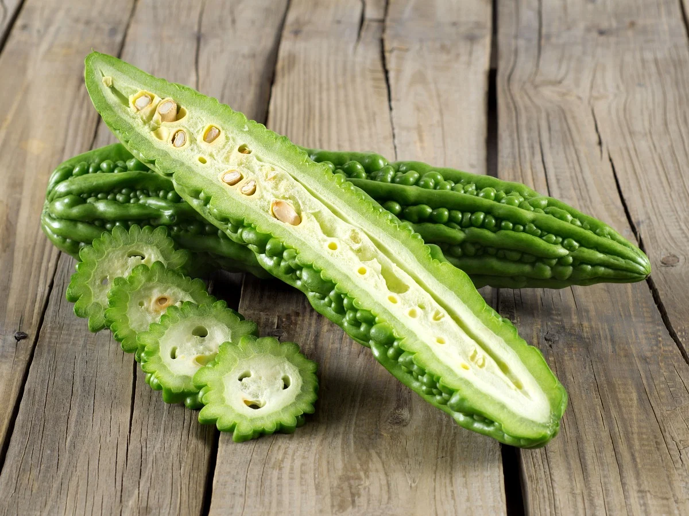

## Garlic
**Scientific Name:** Allium sativum

**Details:** Allium sativum, commonly known as garlic, is a species in the onion genus. Garlic is easy to grow and can be grown year-round in mild climates.

**Uses:** 
- Garlic is also alleged to help regulate blood sugar levels. Regular and prolonged use of therapeutic amounts of aged garlic extracts lower blood homocysteine levels and has been shown to prevent some complications of diabetes mellitus.
- Garlic was used as an antiseptic to prevent gangrene.
- Garlic cloves are used as a remedy for infections (especially chest problems), digestive disorders, and fungal infections.

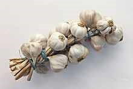

## Black Cohosh
**Details:** Black cohosh is a smooth (glabrous) herbaceous perennial plant that produces large, compound leaves from an underground rhizome, reaching a height of 25–60 centimetres (9.8–23.6 in). The basal leaves are up to 1 metre (3 ft 3 in) long and broad, forming repeated sets of three leaflets (tripinnately compound) having a coarsely toothed (serrated) margin. The flowers are produced in late spring and early summer on a tall stem, 75–250 centimetres (30–98 in) tall, forming racemes up to 50 centimetres (20 in) long. The flowers have no petals or sepals, and consist of tight clusters of 55-110 white, 5–10 mm long stamens surrounding a white stigma. The flowers have a distinctly sweet, fetid smell that attracts flies, gnats, and beetles. The fruit is a dry follicle 5–10 mm long, with one carpel, containing several seeds.

**Uses:** It is used to treat gynecological and other disorders, including sore throats, kidney problems, and depression.

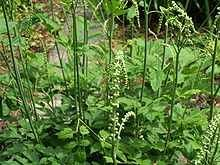

## Bitter Leaf
**Scientific Name:** Vernonia amygdalina

**Details:** Vernonia is a genus of about 1000 species of forbs and shrubs in the family Asteraceae. Some species are known as Ironweed. Some species are edible and of economic value. They are known for having intense purple flowers. The genus is named for English botanist William Vernon. There are numerous distinct subgenera and subsections in this genus.

**Uses:** Vernonia amygdalina is well known as a medicinal plant with several uses attributed to it, including for diabetes, fever reduction, and recently a non-pharmaceutical solution to persistent fever, headache, and joint pain associated with AIDS (an infusion of the plant is taken as needed).

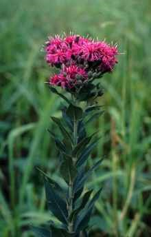

## Amla
**Details:** Amla is a place in Madhya Pradesh in India.Amla junction is 38 km from Betul on rail route towards Nagpur . By road Amla is about 35 km from Betul.Amla is bordered to the south by low lying ridges of Deccan Trap. Northwestern part is also a hilly terrain with height up to 843 m from M.S.L. The area in between is mostly plain with undulatory topography formed by narrow strike ridges. General ground level is 720-740 m above M.S.L.The region enjoys hot & humid dry subtropical climate with maximum average temperature of 32°C. Southeast monsoon remains active during June to September. The average rainfall in the area is 1005 mm. The summer lasts between March and June whereas winter prevails between October and February. Occasionally temperature touches >40°C during summer.

**Uses:** Although Ayurvedic doctors have a great deal of experience with the use of Amla, little human research is available in the West. Research has been done with amla evaluating its role as an antioxidant, in ulcer prevention, for people with diabetes, for mental and memory effects, and its anti-inflammatory benefits.

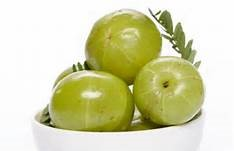

## Arjun
**Details:** The arjuna is about 20–25 metres tall; usually has a buttressed trunk, and forms a wide canopy at the crown, from which branches drop downwards. It has oblong, conical leaves which are green on the top and brown below; smooth, grey bark; it has pale yellow flowers which appear between March and June; its glabrous, 2.5 to 5 cm

 fibrous woody fruit, divided into five wings, appears between September and November.

**Uses:** Heart disorders, low semen density, coughs,blood purifier, leucorrhea. Bark is soaked in water overnight. The following morning, thewater is taken orally with sugarcane molasses in the form of a sherbet.

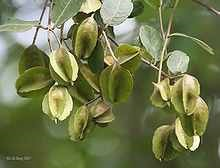

## Ashok
**Details:** The ashoka is a rain-forest tree. Its original distribution was in the central areas of the Deccan plateau, as well as the middle section of the Western Ghats in the western coastal zone of the Indian subcontinent.The ashoka is prized for its beautiful foliage and fragrant flowers. It is a handsome, small, erect evergreen tree, with deep green leaves growing in dense clusters.

**Uses:** Rise of blood pressure during night. Bark of Abroma augusta is mixed with bark of Saraca asoca, bark or root of Rauwolfia serpentina andthen powdered or boiled in water. The powder or water is taken for 7 days.

## Bashok
**Details:** Bashoka consists of the fresh or dried leaves of Adhatoda Vasica, Nees (N.O. Acanthaceae), a shrub growing in India. The leaves vary from 10 to 15 centimeters in length, and are about 4 centimeters broad; they are opposite, entire, lanceolate, and shortly petiolate, tapering towards both apex and base. When dry they are of a dull brownish-green colour; odour, characteristic; taste, bitter.

**Uses:** It is used in Coughs, mucus, fever. Juice obtained fromcrushed leaves is taken orally.Tuberculosis, passing of blood through themouth due to lung disorders. Dried andpowdered bark is taken orally.

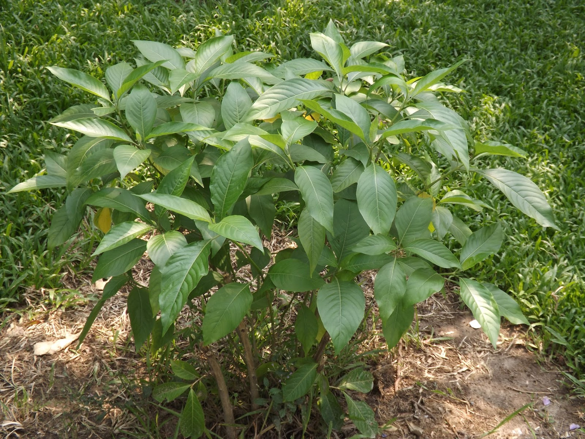

## Thankuni Pata
**Details:** Thankuni  grows in tropical swampy areas. The stems are slender, creeping stolons, green to reddish-green in color, connecting plants to each other. It has long-stalked, green, reniform leaves with rounded apices which have smooth texture with palmately netted veins. The leaves are borne on pericladial petioles, around 2 cm.

**Uses:** It is used in Bloating, gastrointestinal disorders (diarrhea,dysentery), to increase memory. Juice obtain from crushed leaves and stems is taken till cure.

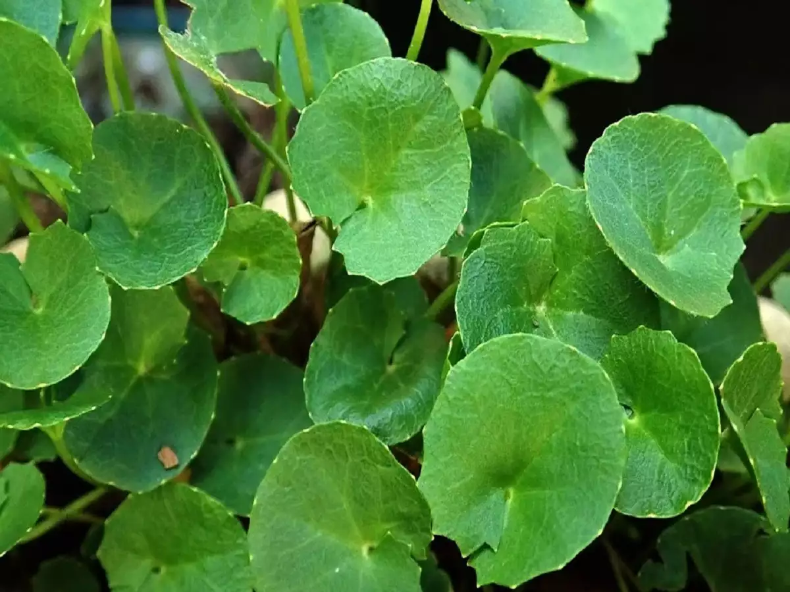

## Swarna Lota
**Details:** This ornamental flowering plant is having several common names, such as peacock flower, Pride of Barbados, Dwarf poinciana, etc. In our country Bangladesh.

**Uses:** It is used in Gastric troubles. Juice obtained from crushedstems is orally taken with sugarcane molassesfor 7 days.

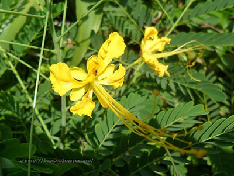

## Tith Baegun
**Details:** The plant is usually 2 or 3 m in height and 2 cm in basal diameter, but may reach 5m in height and 8 cm in basal diameter. The shrub usually has a single stem at ground level, but it may branch on the lower stem. The stem bark is gray and nearly smooth with raised lenticels. The inner bark has a green layer over an ivory color. The plants examined by the author, growing on firm soil, had weak taproots and well-developed laterals. The roots are white.

**Uses:** It is used in Fever, coughs, loss of appetite, leprosy, heartdisorders. Juice obtained from whole plant istaken orally.Entering of thorn in any part of the body. Rootsare inserted into a banana fruit and taken orally in the morning (thorns come out by themselvesfollowing this procedure).

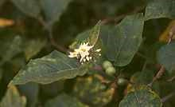

## Beal
**Details:** Gastroduodenal ulcers are the most common form of gastric ulcers. Such ulcers develop when there is an imbalance in the acid mucosa levels, or due to oxidative stress along the gastric tract. Experiments gave positive results in gastric ulcer inhibition. The phenolic compounds found in bael extracts possessed potent antioxidants which helped in reducing gastric ulcers.

**Uses:** 
- Oxidative stress induced hyerglacemia or diabetes can be reduced to a great extent by extracts of bael leaf. Studies have shown that administering leaf extracts of bael reduced blood glucose levels up to 54%.
- Bael leaf extracts were studied for their cholesterol control. They were effective in decreasing blood cholesterol levels comparable to modern drugs. Bael leaf extracts controlled not just blood cholesterol levels but also triglycerides and serum and tissue lipid profiles.

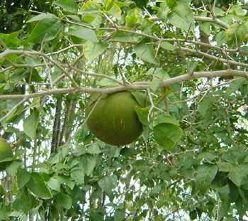

## Tulsi
**Details:** The tulsi plant has many medicinal properties. The leaves are a nerve tonic and also sharpen memory. They promote the removal of the catarrhal matter and phlegm from the bronchial tube. The leaves strengthen the stomach and induce copious perspiration. The seed of the plant are mucilaginous.

**Uses:** 
- Tulsi is an important constituent of many Ayurvedic cough syrups and expectorants. It helps to mobilize mucus in bronchitis and asthma. Chewing tulsi leaves relieves cold and flu.
- Water boiled with basil leaves can be taken as drink in case of sore throat. This water can also be used as a gargle.
- Basil has strengthening effect on the kidney. In case of renal stone the juice of basil leaves and honey, if taken regularly for 6 months it will expel them via the urinary tract.

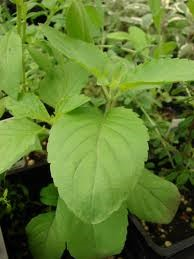

## Brahmi
**Scientific Name:** Bacopa monnieri

**Details:** Brahmi is a creeping herb native to wetlands in India, particularly common in the Eastern and Western Ghats. It has small, succulent leaves and produces tiny white flowers. Traditionally, it is grown in moist, shaded areas. Brahmi is known for its distinct bitter taste and has been used in Ayurvedic medicine for centuries.

**Uses:** 
- Brahmi is renowned for its cognitive enhancing properties. It is believed to improve memory, concentration, and overall cognitive function.
- It is also used to alleviate stress, anxiety, and depression due to its calming effects on the nervous system.
- Additionally, Brahmi is used to treat insomnia, epilepsy, and as a general tonic for the brain and nervous system.

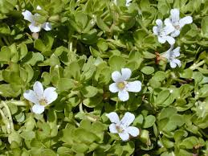

## Ashwagandha
**Scientific Name:** Withania somnifera

**Details:** Ashwagandha, also known as Indian ginseng, is a small shrub with yellow flowers native to India and North Africa. It grows in dry regions and is characterized by its distinctive smell, reminiscent of horse sweat (hence its name, which translates to "smell of horse" in Sanskrit).

**Uses:** 
- Ashwagandha is an adaptogen, meaning it helps the body adapt to stressors and promotes balance.
- It is commonly used to reduce stress, anxiety, and cortisol levels, promoting a sense of calm and relaxation.
- Ashwagandha is also believed to enhance strength, stamina, and overall vitality. It is used to improve physical performance and libido.

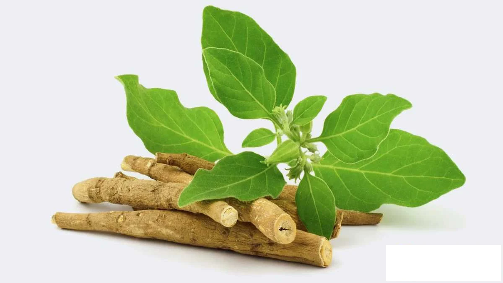

## Triphala
**Details:** Triphala is a combination of three fruits – Indian gooseberry (Emblica officinalis), black myrobalan (Terminalia chebula), and belleric myrobalan (Terminalia bellirica). It is one of the most renowned herbal formulas in Ayurveda and has been used for thousands of years.

**Uses:** 
- Triphala is primarily known for its digestive benefits. It supports healthy digestion, relieves constipation, and detoxifies the digestive tract.
- It is also believed to promote longevity and overall vitality by rejuvenating the body and balancing the doshas (energetic forces) according to Ayurvedic principles.
- Triphala is used to support healthy weight management, improve eyesight, and enhance immune function.

## Guduchi
**Scientific Name:** Tinospora cordifolia

**Details:** Guduchi, also known as Giloy or Amrita, is a climbing shrub native to the Indian subcontinent. It has heart-shaped leaves and produces yellow flowers. Guduchi is known for its bitter taste and is traditionally considered a rasayana, or rejuvenating herb, in Ayurveda.

**Uses:** 
- Guduchi is used to boost the immune system and enhance the body's resistance to infections and illnesses.
- It is also believed to have anti-inflammatory properties and is used to alleviate inflammatory conditions such as arthritis.
- Guduchi is used to detoxify the body, purify the blood, and support liver function. It is considered beneficial for overall health and vitality.

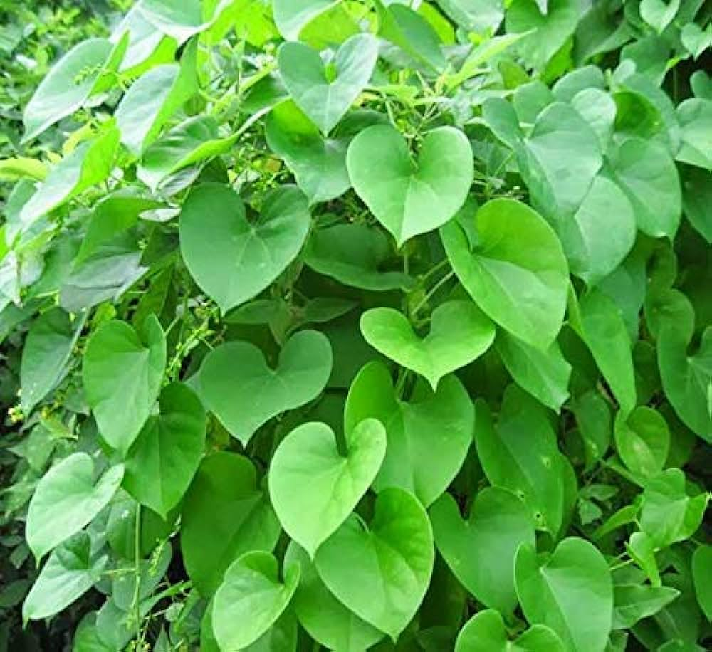

## Shatavari
**Scientific Name:** Asparagus racemosus

**Details:** Shatavari is a species of asparagus native to India and the Himalayas. It is a climbing plant with needle-like leaves and small, white flowers. The roots of shatavari are particularly valued in Ayurvedic medicine for their medicinal properties.

**Uses:** 
- Shatavari is known as the "queen of herbs" in Ayurveda and is primarily used to support women's health. It is believed to balance hormonal levels, regulate menstrual cycles, and alleviate symptoms of menopause.
- It is also used as a rejuvenating tonic for the reproductive system and is believed to enhance fertility and libido in both men and women.
- Shatavari is used to promote digestion, reduce inflammation, and support overall vitality and well-being.

## Haritaki
**Scientific Name:** Terminalia chebula

**Details:** Haritaki is a deciduous tree native to Southeast Asia, particularly India and Nepal. It has oval-shaped leaves and produces small, greenish-yellow fruits. The dried fruit of haritaki is used in Ayurvedic medicine for its therapeutic properties.

**Uses:** 
- Haritaki is considered one of the best herbs for detoxification and rejuvenation in Ayurveda. It is believed to cleanse the digestive tract, remove toxins from the body, and promote healthy elimination.
- It is used to support healthy digestion, relieve constipation, and improve appetite.
- Haritaki is also believed to have anti-inflammatory, antimicrobial, and antioxidant properties, making it beneficial for overall health and well-being.

## Punarnava
**Scientific Name:** Boerhavia diffusa

**Details:** Punarnava is a perennial herb native to India, commonly found in moist or marshy areas. It has slender stems, lance-shaped leaves, and small pink flowers. The entire plant, including the roots, stems, and leaves, is used in Ayurvedic medicine.

**Uses:** 
- Punarnava is known for its diuretic properties and is used to support kidney and urinary tract health. It helps to flush out toxins and excess fluids from the body.
- It is used to reduce inflammation, swelling, and edema in conditions such as arthritis, gout, and fluid retention.
- Punarnava is also believed to have hepatoprotective properties and is used to support liver function and detoxification.

## Manjistha
**Scientific Name:** Rubia cordifolia

**Details:** Manjistha is a perennial climbing herb native to India, Sri Lanka, and the Himalayas. It has woody stems, heart-shaped leaves, and small greenish-white flowers. The roots of manjistha are particularly valued in Ayurvedic medicine for their medicinal properties.

**Uses:** 
- Manjistha is known for its blood-purifying properties and is used to support healthy skin and complexion. It helps to remove toxins from the blood and promotes clear, radiant skin.
- It is used to reduce inflammation, swelling, and pain associated with inflammatory conditions such as arthritis and gout.
- Manjistha is also believed to have antimicrobial and antioxidant properties, making it beneficial for overall health and well-being.

## Shankhpushpi
**Scientific Name:** Convolvulus pluricaulis

**Details:** Shankhpushpi is a perennial herb native to India, commonly found in moist or marshy areas. It has slender stems, small lance-shaped leaves, and blue or white flowers with a funnel-shaped corolla. The entire plant, including the stems, leaves, and flowers, is used in Ayurvedic medicine.

**Uses:** 
- Shankhpushpi is known for its cognitive-enhancing properties and is used to support healthy brain

 function and memory. It helps to improve concentration, focus, and mental clarity.
- It is used to reduce stress, anxiety, and nervousness, promoting a sense of calm and relaxation.
- Shankhpushpi is also believed to have neuroprotective properties and is used to prevent age-related cognitive decline and improve overall cognitive health.

## Vidari Kanda
**Scientific Name:** Pueraria tuberosa

**Details:** Vidari Kanda is a perennial climbing herb native to India, commonly found in tropical and subtropical regions. It has twining stems, trifoliate leaves, and small purple or white flowers. The tuberous roots of Vidari Kanda are particularly valued in Ayurvedic medicine for their medicinal properties.

**Uses:** 
- Vidari Kanda is known as a rasayana, or rejuvenating herb, in Ayurveda and is used to promote vitality, strength, and longevity.
- It is used to support healthy reproductive function and libido in both men and women. It helps to improve fertility, sexual desire, and performance.
- Vidari Kanda is also used to reduce inflammation, promote tissue regeneration, and support overall health and well-being.

## Kutki
**Scientific Name:** Picrorhiza kurroa

**Details:** Kutki is a small perennial herb native to the Himalayan region, particularly India, Nepal, and Tibet. It has lance-shaped leaves and produces small purple flowers. The roots of kutki are particularly valued in Ayurvedic medicine for their bitter taste and medicinal properties.

**Uses:** 
- Kutki is known for its hepatoprotective properties and is used to support liver health and detoxification. It helps to protect the liver from damage and promotes liver function.
- It is used to reduce inflammation, support digestive health, and improve appetite. Kutki is often used to treat digestive disorders such as indigestion, constipation, and dyspepsia.
- Kutki is also believed to have antimicrobial, antioxidant, and immunomodulatory properties, making it beneficial for overall health and well-being.

## Jatamansi
**Scientific Name:** Nardostachys jatamansi

**Details:** Jatamansi is a perennial herb native to the Himalayan region, particularly India, Nepal, and Tibet. It has long, narrow leaves and produces small pink or purple flowers. The rhizomes and roots of jatamansi are particularly valued in Ayurvedic medicine for their medicinal properties.

**Uses:** 
- Jatamansi is known for its calming and sedative properties and is used to reduce stress, anxiety, and nervousness. It helps to promote relaxation, tranquility, and mental clarity.
- It is used to support healthy sleep patterns and treat insomnia, restlessness, and sleep disorders. Jatamansi is often used as a natural remedy for improving sleep quality and duration.
- Jatamansi is also believed to have neuroprotective, antioxidant, and anti-inflammatory properties, making it beneficial for overall brain health and cognitive function.

## Yashtimadhu
**Scientific Name:** Glycyrrhiza glabra

**Details:** Yashtimadhu, also known as licorice or mulethi, is a perennial herb native to the Mediterranean region, Western Asia, and India. It has compound leaves and produces small purple or white flowers. The roots and rhizomes of Yashtimadhu are particularly valued in Ayurvedic medicine for their sweet taste and medicinal properties.

**Uses:** 
- Yashtimadhu is known for its demulcent and expectorant properties and is used to soothe and protect the mucous membranes of the respiratory and digestive tracts. It helps to relieve cough, sore throat, and other respiratory conditions.
- It is used to support healthy digestion, reduce inflammation, and promote gastric health. Yashtimadhu is often used to treat ulcers, gastritis, and acid reflux.
- Yashtimadhu is also believed to have immunomodulatory, antioxidant, and anti-inflammatory properties, making it beneficial for overall health and well-being.

## Amalaki
**Scientific Name:** Phyllanthus emblica

**Details:** Amalaki, also known as Indian gooseberry or amla, is a deciduous tree native to India and Southeast Asia. It has feathery leaves and produces small, round greenish-yellow fruits. The fruits of amalaki are particularly valued in Ayurvedic medicine for their sour taste and medicinal properties.

**Uses:** 
- Amalaki is known as a rasayana, or rejuvenating herb, in Ayurveda and is used to promote longevity, vitality, and overall health and well-being.
- It is one of the richest natural sources of vitamin C and is used to boost the immune system, improve digestion, and support healthy skin and hair.
- Amalaki is also believed to have antioxidant, anti-inflammatory, and antimicrobial properties, making it beneficial for preventing and treating a wide range of diseases and disorders.

## Gokshura
**Scientific Name:** Tribulus terrestris

**Details:** Gokshura, also known as puncture vine or gokhru, is a small annual plant native to the Mediterranean region, Europe, Asia, and Africa. It has small, yellow flowers and produces spiny fruit that resembles goat heads. The seeds and fruits of gokshura are particularly valued in Ayurvedic medicine for their medicinal properties.

**Uses:** 
- Gokshura is known for its diuretic and aphrodisiac properties and is used to support kidney and urinary tract health. It helps to flush out toxins and promote healthy urine flow.
- It is used to support reproductive health and libido in both men and women. Gokshura is believed to improve fertility, sexual desire, and performance.
- Gokshura is also used to reduce inflammation, improve muscle strength and endurance, and support overall vitality and well-being.

## Vacha
**Scientific Name:** Acorus calamus

**Details:** Vacha, also known as sweet flag or calamus, is a perennial herb native to India, Europe, and North America. It has long, sword-shaped leaves and produces small, greenish-yellow flowers. The rhizomes and roots of vacha are particularly valued in Ayurvedic medicine for their medicinal properties.

**Uses:** 
- Vacha is known for its cognitive-enhancing properties and is used to improve memory, concentration, and mental clarity. It helps to stimulate and rejuvenate the brain and nervous system.
- It is used to reduce stress, anxiety, and nervousness, promoting a sense of calm and relaxation. Vacha is often used as a natural remedy for treating insomnia, restlessness, and sleep disorders.
- Vacha is also believed to have antimicrobial, anti-inflammatory, and analgesic properties, making it beneficial for overall health and well-being.

## Brahmi Booti
**Scientific Name:** Cent

ella asiatica

**Details:** Brahmi Booti, also known as gotu kola or Indian pennywort, is a perennial herb native to Asia, particularly India, China, and Southeast Asia. It has kidney-shaped leaves and produces small, pink or white flowers. The entire plant, including the leaves and stems, is used in Ayurvedic medicine for its medicinal properties.

**Uses:** 
- Brahmi Booti is known for its cognitive-enhancing properties and is used to improve memory, concentration, and overall cognitive function. It helps to stimulate and rejuvenate the brain and nervous system.
- It is used to reduce stress, anxiety, and nervousness, promoting a sense of calm and relaxation. Brahmi Booti is often used as a natural remedy for treating insomnia, restlessness, and sleep disorders.
- Brahmi Booti is also believed to have anti-inflammatory, antioxidant, and antimicrobial properties, making it beneficial for overall health and well-being.

## Kalmegh
**Scientific Name:** Andrographis paniculata

**Details:** Kalmegh, also known as king of bitters or bhunimba, is an annual herb native to India, China, and Southeast Asia. It has lance-shaped leaves and produces small, white or purple flowers. The entire plant, including the leaves, stems, and roots, is used in Ayurvedic medicine for its bitter taste and medicinal properties.

**Uses:** 
- Kalmegh is known for its immunomodulatory properties and is used to boost the immune system and enhance the body's resistance to infections and illnesses. It helps to stimulate the production of white blood cells and promote overall immunity.
- It is used to reduce inflammation, fever, and pain associated with various inflammatory conditions such as arthritis, rheumatism, and dengue fever.
- Kalmegh is also believed to have hepatoprotective, antioxidant, and antimicrobial properties, making it beneficial for liver health and overall well-being.

## Neem Tulsi
**Details:** Neem Tulsi is a combination of two potent herbs, neem (Azadirachta indica) and tulsi (Ocimum tenuiflorum), known for their medicinal properties. Neem Tulsi is commonly used in Ayurvedic medicine for its diverse health benefits.

**Uses:** 
- Neem Tulsi is known for its antibacterial, antiviral, and antifungal properties and is used to treat various infections and skin disorders. It helps to purify the blood and promote healthy skin and complexion.
- It is used to boost the immune system and enhance the body's resistance to infections and illnesses. Neem Tulsi helps to strengthen the immune response and protect against pathogens.
- Neem Tulsi is also believed to have anti-inflammatory, antioxidant, and analgesic properties, making it beneficial for reducing inflammation, pain, and oxidative stress in the body.

## Shankhpushpi Saraswati
**Details:** Shankhpushpi Saraswati is a combination of Shankhpushpi (Convolvulus pluricaulis) and Saraswati (Bacopa monnieri), two revered herbs known for their cognitive-enhancing properties. Shankhpushpi Saraswati is commonly used in Ayurvedic medicine to support brain health and cognitive function.

**Uses:** 
- Shankhpushpi Saraswati is known for its neuroprotective properties and is used to improve memory, concentration, and overall cognitive function. It helps to stimulate and rejuvenate the brain and nervous system.
- It is used to reduce stress, anxiety, and nervousness, promoting a sense of calm and relaxation. Shankhpushpi Saraswati is often used as a natural remedy for treating insomnia, restlessness, and sleep disorders.
- Shankhpushpi Saraswati is also believed to have antioxidant, anti-inflammatory, and antimicrobial properties, making it beneficial for overall brain health and cognitive function.

## Nagarmotha
**Scientific Name:** Cyperus rotundus

**Details:** Nagarmotha, also known as nutgrass or musta, is a perennial herb native to India, Africa, and Southeast Asia. It has slender stems, long, narrow leaves, and small brown flowers. The rhizomes and roots of nagarmotha are particularly valued in Ayurvedic medicine for their medicinal properties.

**Uses:** 
- Nagarmotha is known for its digestive and carminative properties and is used to support healthy digestion, reduce flatulence, and relieve abdominal discomfort. It helps to improve appetite and promote healthy digestion.
- It is used to reduce inflammation, pain, and fever associated with various inflammatory conditions such as arthritis, rheumatism, and dysmenorrhea.
- Nagarmotha is also believed to have diuretic, antimicrobial, and antioxidant properties, making it beneficial for urinary tract health and overall well-being.

## Kaunch Beej
**Scientific Name:** Mucuna pruriens

**Details:** Kaunch Beej, also known as velvet bean or kapikachhu, is a leguminous climbing shrub native to India, Africa, and Southeast Asia. It has trifoliate leaves and produces clusters of purple or white flowers. The seeds of kaunch beej are particularly valued in Ayurvedic medicine for their medicinal properties.

**Uses:** 
- Kaunch Beej is known for its aphrodisiac properties and is used to support reproductive health and libido in both men and women. It helps to improve fertility, sexual desire, and performance.
- It is used to reduce stress, anxiety, and nervousness, promoting a sense of calm and relaxation. Kaunch Beej is often used as a natural remedy for treating insomnia, restlessness, and sleep disorders.
- Kaunch Beej is also believed to have neuroprotective, antioxidant, and anti-inflammatory properties, making it beneficial for overall brain health and cognitive function.

